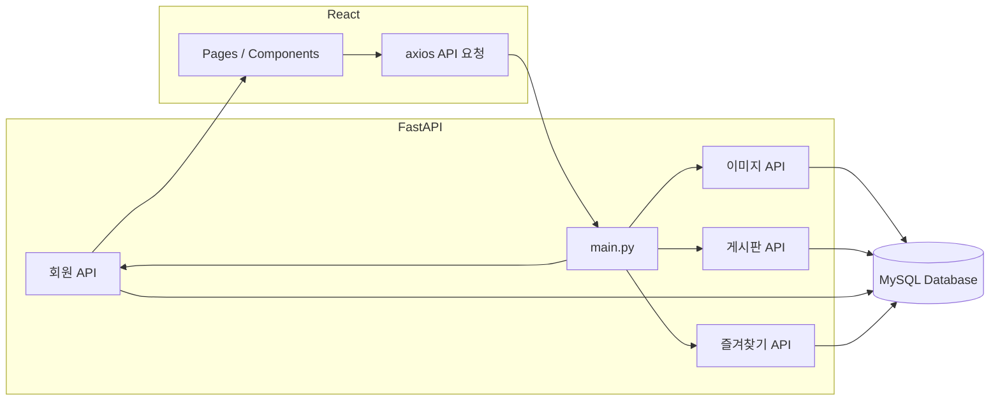
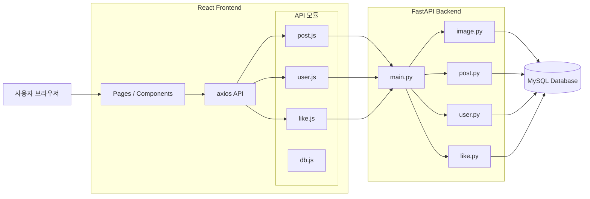
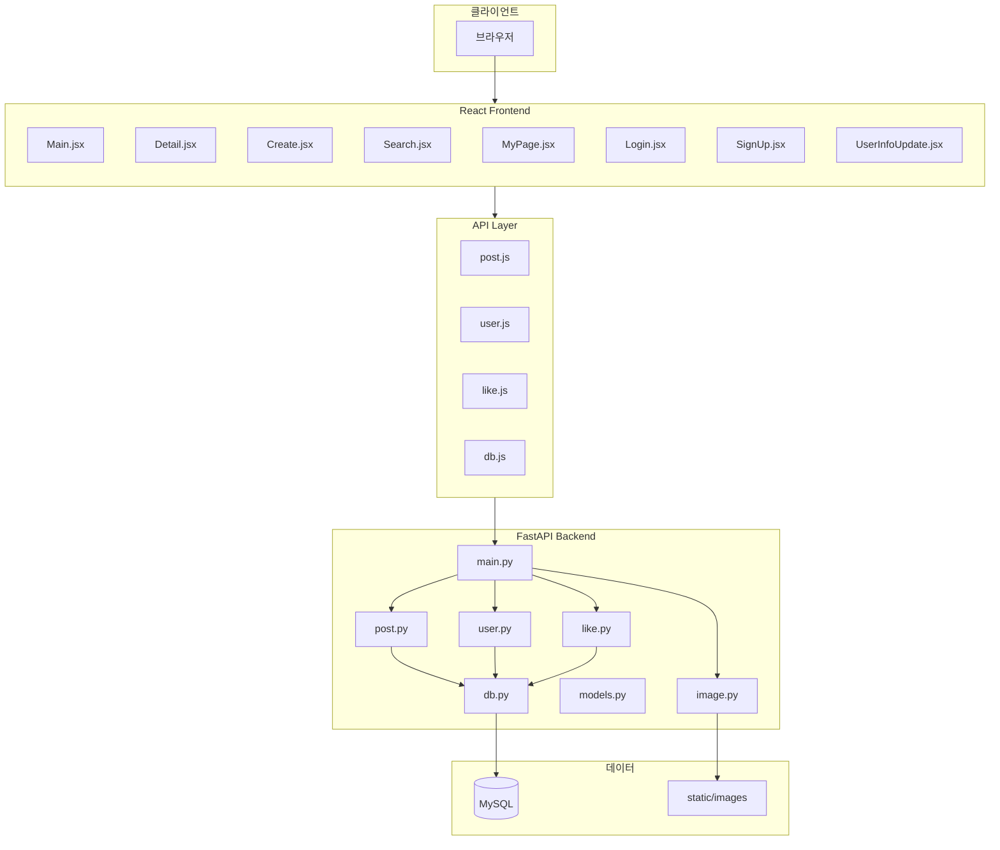

# Inviz_simple_board 시스템 아키텍처

## 시스템 구성도 (요약)

## 시스템 구성도 (상세)

## 상세 아키텍처 (계층별)

## 백엔드 라우터 역할

| 라우터 | 파일 | 역할 |
|--------|------|------|
| image | image.py | 이미지 업로드/저장, 이미지 URL 제공 |
| post | post.py | 게시글 CRUD, 검색, 페이징, 마이페이지 목록 |
| user | user.py | 로그인, 회원가입, 회원정보 수정, 중복 확인 |
| like | like.py | 좋아요 토글, 좋아요 목록/페이징 |

## 프론트엔드 API 모듈 역할

| 모듈 | 파일 | 역할 |
|------|------|------|
| post | post.js | 게시글·검색·페이징·마이글 목록 관련 요청 |
| user | user.js | 로그인·회원가입·회원정보·비밀번호 확인·중복 확인 |
| like | like.js | 좋아요 토글·확인·목록·페이징 |
| db | db.js | axios 인스턴스(baseURL 등 공통 설정) |
